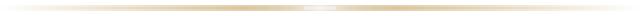

  

  

 

 

## Osimdzhon B.

Backend engineer. Java / Spring, Flutter on the client side, PostgreSQL and MongoDB underneath.

 

  
  
  
  
   

 

  

  

<strong>Focus</strong> — building a full-stack project end to end, architecture before features.

 

<strong>Background</strong> — Higher College of Informatics, Novosibirsk State University.

  

  

 

<h2>Languages</h2>

  

  

  
  
    
  
     
  
    

